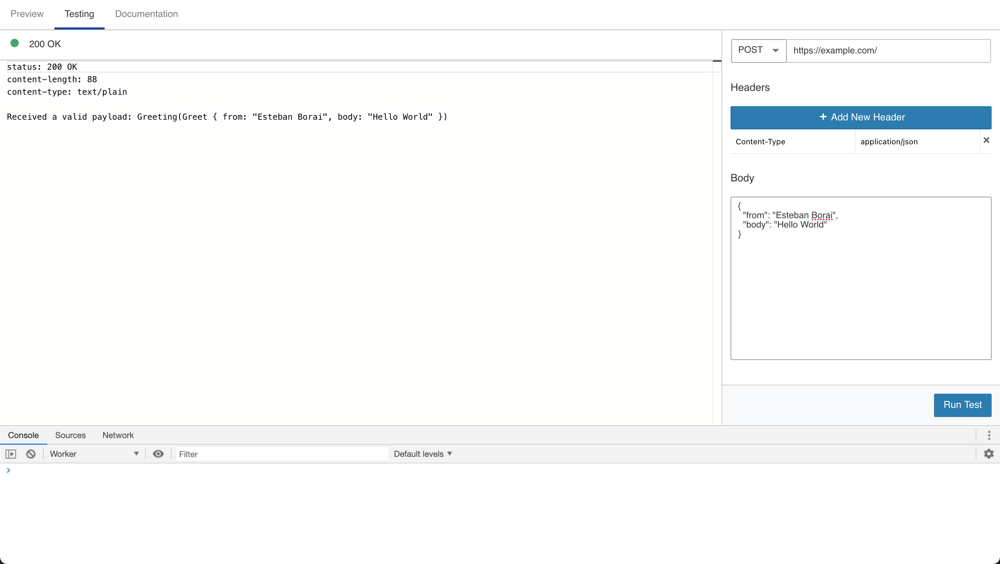

<div>
  <div align="center" style="display: block; text-align: center;">
    
  </div>
  <h1 align="center">website-cache-worker</h1>
  <h4 align="center">👷🏻‍♂️ Rust Cloudflare Worker to handle HTTP requests</h4>
</div>

<div align="center">
  
</div>

## Motivation

The Rusty Cloudflare Worker is an template project to have a Cloudflare worker
which makes use of Rust and WASM to handle your HTTP requests.

The only relevant difference between this worker and the template from
Cloudflare (Available [here](https://github.com/cloudflare/rustwasm-worker-template)) is:

- This template will take the HTTP request and pass it to Rust via JSON, this
means you will have an array of bytes and you limit yourself to rely on plain
data. Theres no support (at the moment of this writing) for binary data.

- The HTTP `Request` object from JavaScript it turned into a `http::Request<T>`
instance, which means you are able to consume the API from `http::Request<T>`.

- The HTTP response is built from a `http::Response` struct from the `http`
crate as well.

If you don't rely on consuming the incoming HTTP Request then the:
https://github.com/cloudflare/rustwasm-worker-template is your best bet.

I think that theres more we can do for performance inside of the `src/core`
directory.

## Requirements

- NodeJS: Scripts under the `script/` directory require NodeJS/NPM in order to
execute the `npx` command.
- Rust

## Usage

1. Create your project by clicking on: `Use template` button up there.

2. In your repository settings section you must provide the following
secrets:

Secret | Description
--- | ---
CF_EMAIL | Cloudflare user email
CF_API_KEY | Cloudflare Global API Key. Check on `scripts/publish.sh` to change this behavior.
CF_ACCOUNT_ID | Cloudflare Account ID
CF_ZONE_ID | Cloudflare Zone ID

These secrets are used by the `.github/workflows/deploy.yml` file, when a new
release is created. If you want to change that refer to: `.github/workflows/deploy.yml`.

3. Clone the project locally, the logic for your application should live in
the `src/app` directory. The `src/app/mod.rs` file contains the logic to receive
a `http::Request` and return a `http::Response`.

4. When you are done with your implementation release your worker by pushing a
tag prefixed with `v` as follows:

```sh
git tag -a  v0.1.0 -m "First release"

git push origin main --follow-tags
```

If nothing is changed in the `deploy` workflow, this should trigger a deploy.

## Scripts

Some scripts are available to help you in your workflow. These scripts are
available in the `scripts/` directory.

Filename | Description
--- | ---
`build.sh` | Runs `@cloudflare/wrangler build` to build your worker
`make-wrangler.sh` | Creates a `wrangler.toml` file
`publish.sh` | Publishes your worker using `@cloudflare/wrangler publish`. You must provide: `CF_EMAIL` with your cloudflare account email and `CF_API_KEY` with your Global API Key. Refer to: https://developers.cloudflare.com/workers/cli-wrangler/authentication#using-environment-variables for more details in case you want to change this behavior.
`wrangler-dev.sh` | Runs your worker locally. You must provide the Account ID to the `wrangler.toml` file
`wrangler-preview.sh` | Uploads your worker to a preview environment with tools for debugging.

## Considerations

### Wrangler Dev

If you run the `scripts/wrangler-dev.sh` file you will have an `ACCOUNT_ID` to
the `wrangler.toml`.

Otherwise you will get:

```sh
$ scripts/wrangler-dev.sh

🕵️  You can find your account_id in the right sidebar of your account's Workers page
Error: field `account_id` is required to deploy to workers.dev
```

As a workaround you can always use `scripts/wrangler-preview.sh` instead.

## Contributions

All contributions to this project are welcome. Don't hesitate to either create
a Pull Request, or Issue as you require.
